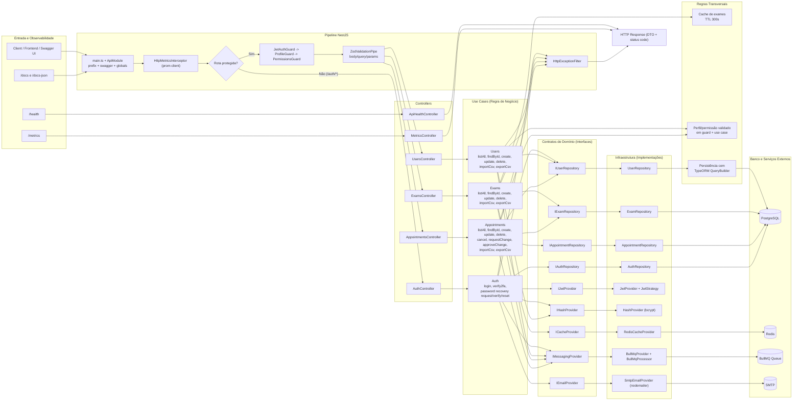
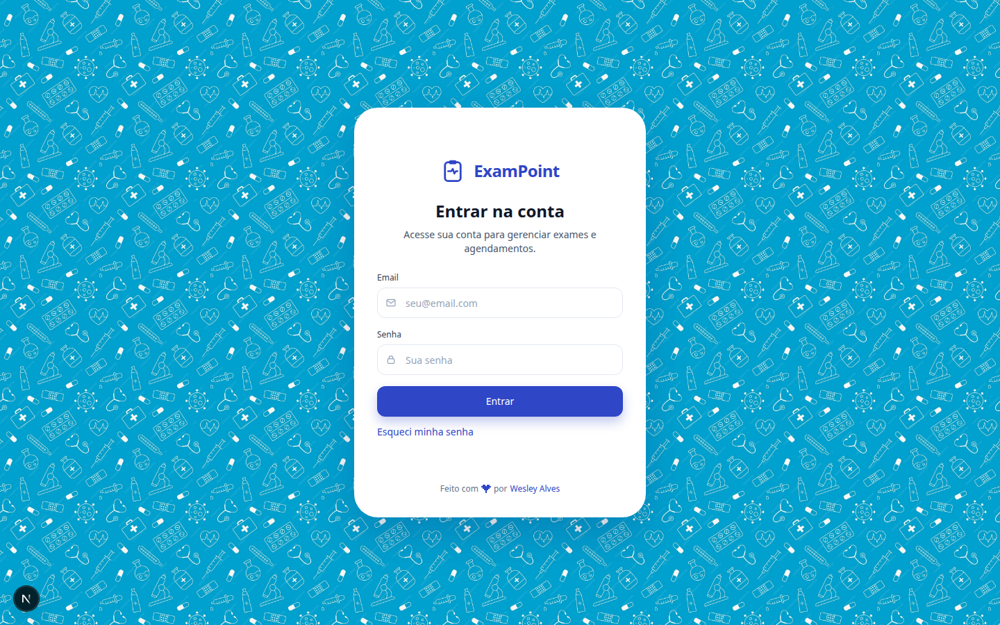
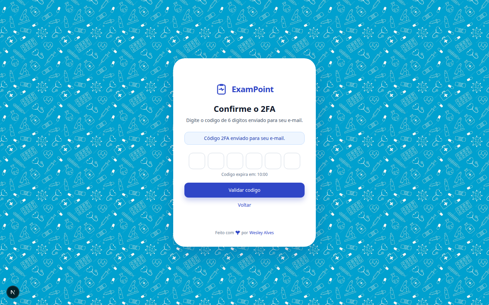
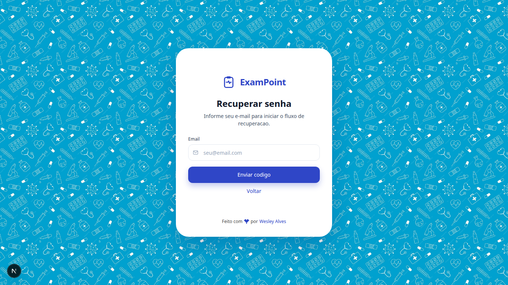
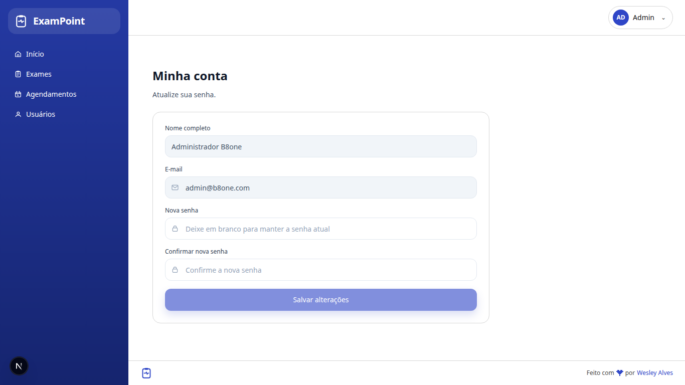
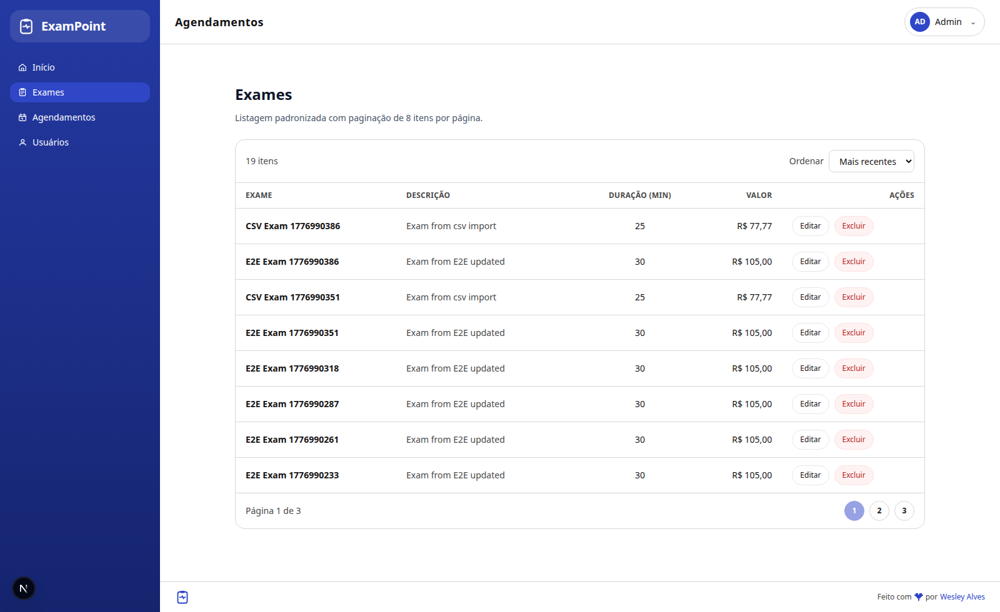
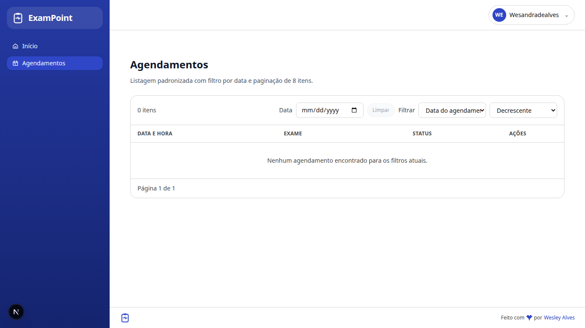
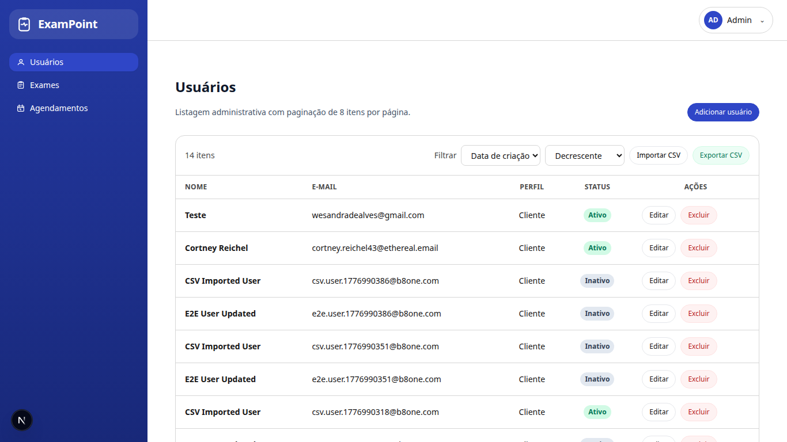

# B8one Plataforma (API + Frontend)

Monorepo com backend em NestJS (DDD) e frontend em Next.js (App Router), com autenticação JWT + 2FA por e-mail, autorização por perfil/permissão, validação com Zod, TypeORM com QueryBuilder e documentação Swagger.

## 1. Stack Técnica

- Node.js 22+
- NestJS 10
- TypeORM 0.3 + PostgreSQL
- Redis + BullMQ (mensageria)
- JWT (Passport)
- Zod (validação de entrada)
- Nodemailer (SMTP)
- Swagger/OpenAPI
- Jest (testes unitários)

## 2. Arquitetura e Padrões

### 2.0 Estrutura do Monorepo

- `api/`: backend NestJS
- `app/`: frontend Next.js
- `docker-compose.yml` (raiz): orquestra frontend + backend + postgres + redis + adminer
- `Dockerfile` (raiz): imagem do backend
- `Dockerfile.frontend` (raiz): imagem do frontend

### 2.1 Camadas

- `api/src/domain`
  - Entidades, enums, contratos (interfaces), tipos e regras comuns.
- `api/src/modules`
  - Módulos de aplicação (`auth`, `users`, `exams`, `appointments`) com:
    - `api/controllers`
    - `api/dto`
    - `api/schemas` (Zod)
    - `use-cases`
- `api/src/infrastructure`
  - Implementações concretas: banco, providers, repositories, guards, swagger, health, metrics.

### 2.2 Padrões aplicados

- Regras de negócio centralizadas em **Use Cases**.
- Controle de acesso (perfil/permissão) no backend com **Guards + Use Cases**.
- Endpoints sem duplicação por perfil: o mesmo endpoint responde conforme o usuário autenticado.
- Persistência via **TypeORM QueryBuilder** (sem raw SQL nos repositories).
- Validação de payload/parâmetros com **ZodValidationPipe**.
- Mensageria centralizada via `IMessagingProvider` (BullMQ).

### 2.3 Fluxograma Completo do Backend



## 3. Perfis, Roles e Permissões

### 3.1 Perfis

- `ADMIN`
- `CLIENT`

### 3.2 Permissões por perfil

Base: `api/src/domain/commons/constants/profile-permissions.constant.ts`

| Permissão | ADMIN | CLIENT |
|---|---:|---:|
| `EXAMS_READ` | Sim | Sim |
| `EXAMS_CREATE` | Sim | Não |
| `EXAMS_UPDATE` | Sim | Não |
| `EXAMS_DELETE` | Sim | Não |
| `EXAMS_IMPORT_CSV` | Sim | Não |
| `EXAMS_EXPORT_CSV` | Sim | Não |
| `USERS_READ` | Sim | Sim |
| `USERS_CREATE` | Sim | Não |
| `USERS_UPDATE` | Sim | Sim |
| `USERS_DELETE` | Sim | Não |
| `USERS_IMPORT_CSV` | Sim | Não |
| `USERS_EXPORT_CSV` | Sim | Não |
| `APPOINTMENTS_CREATE` | Sim | Sim |
| `APPOINTMENTS_READ_OWN` | Sim | Sim |
| `APPOINTMENTS_UPDATE` | Sim | Não |
| `APPOINTMENTS_DELETE` | Sim | Não |
| `APPOINTMENTS_CANCEL_OWN` | Sim | Sim |
| `APPOINTMENTS_REQUEST_CHANGE_OWN` | Sim | Sim |
| `APPOINTMENTS_APPROVE_CHANGE` | Sim | Não |
| `APPOINTMENTS_IMPORT_CSV` | Sim | Não |
| `APPOINTMENTS_EXPORT_CSV` | Sim | Não |

## 4. Regras de Negócio Implementadas

### 4.1 Auth

- `POST /auth/login`
  - Valida credenciais.
  - Gera código 2FA de 6 dígitos com expiração.
  - Envia por e-mail (SMTP).
- `POST /auth/2fa/verify`
  - Código inválido/expirado retorna `401`.
  - Código válido invalida o registro e gera JWT (`Bearer`).
- `POST /auth/password-recovery/request`
  - Recebe e-mail para recuperação.
  - Não expõe existência de usuário (resposta genérica).
  - Para usuário ativo, gera código 2FA de recuperação e envia por e-mail.
- `POST /auth/password-recovery/verify`
  - Valida código 2FA do fluxo de recuperação.
  - Código inválido/expirado retorna `401`.
- `POST /auth/password-recovery/reset`
  - Exige `email`, `code` e `newPassword`.
  - Só atualiza senha com código válido de recuperação.
  - Invalida o código após uso.
  - Publica evento de finalização do fluxo.

### 4.2 Users

- `GET /users/all`
  - `ADMIN`: lista todos (paginado).
  - `CLIENT`: retorna somente o próprio usuário (paginado).
- `GET /users/:id`
  - `ADMIN`: qualquer usuário.
  - `CLIENT`: apenas o próprio.
- `POST /users`, `DELETE /users/:id`
  - Apenas `ADMIN`.
- `PATCH /users/:id`
  - `ADMIN`: pode atualizar perfil/e-mail/status/senha.
  - `CLIENT`: somente próprio perfil e sem alterar `email/profile/isActive`.
- `POST /users/import/csv`
  - Apenas `ADMIN`.
- `GET /users/export/csv`
  - Apenas `ADMIN`.

### 4.3 Exams

- `GET /exams/all`
  - `ADMIN`: todos (ativos e inativos), paginado.
  - `CLIENT`: apenas ativos, paginado.
- `GET /exams/:id`
  - `ADMIN`: pode ver qualquer exame.
  - `CLIENT`: somente exames ativos.
- `POST`, `PATCH`, `DELETE`
  - Apenas `ADMIN`.
- `POST /exams/import/csv`
  - Apenas `ADMIN`.
- `GET /exams/export/csv`
  - Apenas `ADMIN`.

### 4.4 Appointments

- `GET /appointments/all`
  - `ADMIN`: todos, paginado.
  - `CLIENT`: somente os próprios, paginado.
- `GET /appointments/:id`
  - `ADMIN`: qualquer appointment.
  - `CLIENT`: apenas próprio.
- `POST /appointments`
  - Cria agendamento com validação de data futura e conflito de agenda.
- `PATCH /appointments/:id/cancel`
  - Dono ou admin.
- `PATCH /appointments/:id/request-change`
  - Cliente solicita alteração (pendente para aprovação).
- `PATCH /appointments/:id/approve-change`
  - Apenas admin aprova alteração pendente.
- `PATCH /appointments/:id`
  - Apenas admin (edição direta).
- `DELETE /appointments/:id`
  - Apenas admin.
- `POST /appointments/import/csv`
  - Apenas admin.
- `GET /appointments/export/csv`
  - Apenas admin.

## 5. Validações

- Entrada validada com Zod em body/query/param.
- Exemplos:
  - paginação: `page >= 1`, `limit <= 100`;
  - UUIDs obrigatórios em `:id` e refs;
  - `scheduledAt` deve ser data válida e futura nos fluxos de agendamento;
  - payloads de update exigem ao menos um campo.

Formato de erro HTTP padronizado pelo `HttpExceptionFilter`:

```json
{
  "statusCode": 400,
  "timestamp": "2026-04-23T17:42:50.829Z",
  "path": "/exams",
  "message": "Validation failed",
  "details": [
    { "path": "name", "message": "String must contain at least 2 character(s)" }
  ]
}
```

## 6. Endpoints

### 6.1 Infra

- `GET /health`
- `GET /metrics`

### 6.2 Auth

- `POST /auth/login`
- `POST /auth/2fa/verify`
- `POST /auth/password-recovery/request`
- `POST /auth/password-recovery/verify`
- `POST /auth/password-recovery/reset`

### 6.3 Users

- `GET /users/all`
- `GET /users/:id`
- `POST /users`
- `PATCH /users/:id`
- `DELETE /users/:id`
- `POST /users/import/csv`
- `GET /users/export/csv`

### 6.4 Exams

- `GET /exams/all`
- `GET /exams/:id`
- `POST /exams`
- `PATCH /exams/:id`
- `DELETE /exams/:id`
- `POST /exams/import/csv`
- `GET /exams/export/csv`

### 6.5 Appointments

- `GET /appointments/all`
- `GET /appointments/:id`
- `POST /appointments`
- `PATCH /appointments/:id`
- `PATCH /appointments/:id/cancel`
- `PATCH /appointments/:id/request-change`
- `PATCH /appointments/:id/approve-change`
- `DELETE /appointments/:id`
- `POST /appointments/import/csv`
- `GET /appointments/export/csv`

## 6.6 CSV Import/Export (Admin)

Todos os imports recebem JSON no body:

```json
{
  "csvContent": "header1,header2\nvalue1,value2"
}
```

### Users CSV

- Import endpoint: `POST /users/import/csv`
- Export endpoint: `GET /users/export/csv`
- Headers mínimos de import:
  - `fullName,email,profile,isActive`
- Header opcional:
  - `password` (obrigatório somente para criação de novo usuário)

### Exams CSV

- Import endpoint: `POST /exams/import/csv`
- Export endpoint: `GET /exams/export/csv`
- Headers mínimos de import:
  - `name,durationMinutes,priceCents,isActive`
- Headers opcionais:
  - `id` (para update)
  - `description`

### Appointments CSV

- Import endpoint: `POST /appointments/import/csv`
- Export endpoint: `GET /appointments/export/csv`
- Headers mínimos de import:
  - `userId,examId,scheduledAt`
- Headers opcionais:
  - `id` (para update)
  - `status` (`SCHEDULED` ou `CANCELLED`)
  - `notes`

## 7. Swagger e Teste Completo da API

- Swagger UI: `http://localhost:3000/docs`
- OpenAPI JSON: `http://localhost:3000/docs-json`

### 7.1 Fluxo para autenticar no Swagger

1. Execute `POST /auth/login` com e-mail/senha.
2. Pegue o código 2FA recebido por e-mail.
3. Execute `POST /auth/2fa/verify` para receber `accessToken`.
4. Clique em **Authorize** no Swagger e informe:
   - `Bearer <accessToken>`
5. Teste os endpoints protegidos.

### 7.2 Fluxo de recuperação de senha no Swagger

1. Execute `POST /auth/password-recovery/request` com o e-mail.
2. Pegue o código 2FA de recuperação recebido por e-mail.
3. Execute `POST /auth/password-recovery/verify` com `email` e `code`.
4. Após validação, execute `POST /auth/password-recovery/reset` com:
   - `email`
   - `code`
   - `newPassword`
5. Faça login novamente com a nova senha em `POST /auth/login`.


## 8. Seed de Dados

Arquivo: `api/src/infrastructure/database/seeds/run-seed.ts`

### 8.1 Usuários padrão

- Admin
  - e-mail: `cortney.reichel43@ethereal.email`
  - senha: `Admin@123`
  - perfil: `ADMIN`
  - inbox para OTP/2FA: `https://ethereal.email/`
- Cliente
  - e-mail: `cliente@b8one.com`
  - senha: `Client@123`
  - perfil: `CLIENT`
- observação: use as credenciais SMTP configuradas no `.env` da raiz para entrar no painel da inbox de teste.

### 8.2 Exames padrão

Seed inclui 10 exames iniciais (hemograma, glicemia, colesterol, etc.).

## 9. Como Rodar

### 9.1 Pré-requisitos

- Node.js `>=22`
- npm `>=10`
- Docker + Docker Compose

### 9.2 Ambiente

```bash
cp .env.example .env
```

Configurações da orquestração Docker (portas, credenciais e conexões de backend/postgres/redis/adminer), incluindo SMTP/JWT e variáveis públicas do frontend, ficam no `.env` da raiz.

### 9.3 Subir stack completa com Docker 

```bash
docker compose up -d --build
```

A stack sobe:

- `frontend` (`http://localhost:3001`)
- `backend` (`http://localhost:3000`)
- `postgres` (`localhost:5432`)
- `redis` (`localhost:6379`)
- `adminer` (`http://localhost:5050`)

Observação: portas e dados de conexão acima são parametrizados pelo `.env` da raiz.

No container do backend já executa:

- `migration:run:prod`
- `seed:prod`
- `start:prod`

Comandos úteis:

```bash
docker compose logs -f backend
docker compose logs -f frontend
docker compose logs -f adminer
docker compose down
```

### 9.4 Rodar backend isolado (local + infraestrutura em container)

```bash
docker compose up -d postgres redis
cd api
npm ci
export DATABASE_HOST=localhost
export DATABASE_PORT=5432
export DATABASE_USERNAME=postgres
export DATABASE_PASSWORD=postgres
export DATABASE_NAME=b8one
export REDIS_HOST=localhost
export REDIS_PORT=6379
npm run migration:run
npm run seed
npm run start:dev
```

Backend disponível em `http://localhost:3000` e Swagger em `http://localhost:3000/docs`.

### 9.5 Rodar frontend isolado (local)

```bash
cd app
npm ci
npm run dev
```

Frontend disponível em `http://localhost:3001`.

Execução de produção isolada do frontend:

```bash
cd app
npm run build
npm run start -- -H 0.0.0.0 -p 3001
```

### 9.6 Interface do PostgreSQL (Adminer)

Acesso:

- URL: `http://localhost:5050`

Tela de login do Adminer:

- System: `PostgreSQL`
- Server: `postgres`
- Port: `5432`
- Username: `postgres`
- Password: `postgres`
- Database: `b8one`

## 10. Scripts Principais

### 10.1 Backend (`api/`)

```bash
cd api
npm run build
npm run start:dev
npm run start:prod
npm run lint
npm test
npm run migration:run
npm run migration:revert
npm run seed
```

### 10.2 Frontend (`app/`)

```bash
cd app
npm run dev
npm run build
npm run start
npm run typecheck
npm run lint
npm test
```

## 11. Qualidade e Gate de Commit

Hooks Git configurados com Husky:

- `pre-commit`
  - `api`: `npm test -- --runInBand`
  - `app`: `npm run typecheck && npm run lint && npm test -- --runInBand && npm run build`
- `pre-push`
  - `api`: `npm test -- --runInBand`
  - `app`: `npm run typecheck && npm run lint && npm test -- --runInBand && npm run build`

## 12. Frontend (Next.js) - Arquitetura e Testes

### 12.1 Dependências principais

- Next.js 15 + React 19
- TypeScript estrito
- Styled Components (SSR com `src/app/registry.tsx`)
- TailwindCSS + SCSS
- Axios (instância única + interceptors)
- React Query
- Jest + Testing Library

### 12.2 Arquitetura aplicada

- `app/src/app`
  - App Router com grupos de rota:
    - `(public)` para autenticação (`/login`)
    - `(protected)` para área autenticada (`/app/**`)
  - Templates separados por grupo de rota.
  - `middleware.ts` protegendo rotas por cookie JWT.
- `app/src/components`
  - Organização por Atomic Design (`atoms`, `molecules`, `organisms`, `templates`, `pages`).
- `app/src/context` e `app/src/hooks`
  - Contextos centrais (`auth`, `loader`, `feedback`) e hooks wrappers para uso consistente.
- `app/src/services`
  - Camada única de integração HTTP (`api.ts`) e serviços por módulo.
  - Interceptors para loading global e tratamento de `401`.
- `app/src/styles` e `app/src/assets/scss`
  - Tema e paleta centralizados.
  - Tokens compartilhados para manter consistência visual.

### 12.3 Testes do frontend

Executar:

```bash
cd app
npm test
```

Cobertura inclui:

- hooks, contexts e serviços;
- middleware e templates de rota;
- contratos de arquitetura/DRY em `app/test/unit/architecture/patterns.spec.ts`.

### 12.4 Acessibilidade (Frontend)

Implementações aplicadas e validadas no fluxo de autenticação:

- `lang="pt-BR"` no documento.
- Campos com `label` associado e `aria-invalid`/`aria-describedby` para erros.
- Mensagens inline de feedback com região ARIA:
  - `role="alert"` + `aria-live="assertive"` para erro.
  - `role="status"` + `aria-live="polite"` para info/sucesso.
- OTP segmentado com grupo semântico:
  - `role="group"` + `aria-labelledby` do rótulo.
  - `aria-label` por dígito e `aria-describedby` para countdown/erro.
- OTP com navegação por teclado (`ArrowLeft`, `ArrowRight`, `Backspace`) e suporte a `paste`.
- Botões com estado de carregamento usando `aria-busy`.
- Loader global com `role="status"` e `aria-live="polite"`.

### 12.5 Capturas do fluxo de autenticação

#### Login



#### OTP (2FA)



#### Recuperação de senha



#### Minha conta



#### Exames (listagem)



#### Agendamentos (listagem)



#### Usuários (listagem admin)



## 13. Validação Executada (Backend)

Executado em `api/`:

```bash
npm run lint
npm run build
npm test -- --runInBand
```

Resultado: sucesso (`36` suites, `134` testes passando).

### 13.2 E2E autenticado (fluxo completo)

Fluxo validado ponta a ponta com autenticação JWT + 2FA:

- `Auth`: `POST /auth/login`, `POST /auth/2fa/verify` (código inválido bloqueia, código válido libera token), `POST /auth/password-recovery/request`, `POST /auth/password-recovery/verify`, `POST /auth/password-recovery/reset`.
- `Users`: `GET /users/all` (admin vê todos, client vê apenas o próprio), `POST /users`, `PATCH /users/:id`, `GET /users/:id`, `DELETE /users/:id`, com validação de bloqueio de client em ações de admin.
- `Exams`: `GET /exams/all`, `POST /exams`, `PATCH /exams/:id`, `GET /exams/:id`, `DELETE /exams/:id`, com validação de bloqueio de client em ações de admin.
- `Appointments`: `POST /appointments` (incluindo validação de data inválida), `GET /appointments/all`, `PATCH /appointments/:id/request-change`, `PATCH /appointments/:id/approve-change`, `PATCH /appointments/:id/cancel`, `PATCH /appointments/:id`, `DELETE /appointments/:id`, com validação de bloqueio por perfil/permissão.
- `CSV (admin only)`: `POST /users/import/csv`, `GET /users/export/csv`, `POST /exams/import/csv`, `GET /exams/export/csv`, `POST /appointments/import/csv`, `GET /appointments/export/csv`; também validado retorno `403` para usuário client.
